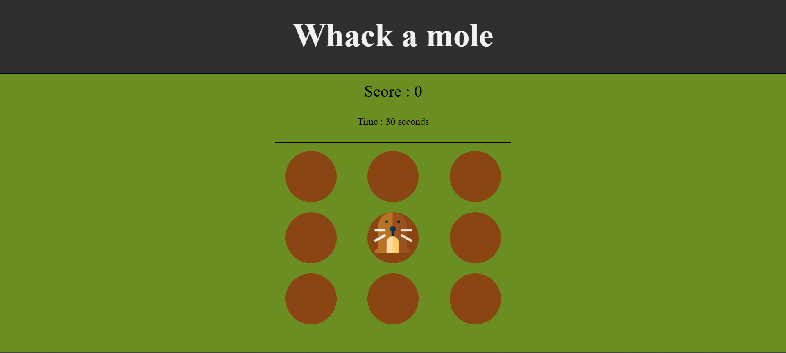

# Whack-a-Mole 🎯

A Fun Fair-Themed Game
This is a simple Whack-a-Mole game, just like the ones you find at fairs! Your goal is to click on the mole as it pops out of the hole. 🔨

## How to Play

When you arrive on the [site](https://patoucheh.github.io/whack-a-mole/), you'll need to choose a difficulty level between 1 and 5. The level determines the mole's speed—nothing else.

## What It Looks Like

#### When you arrive on the site

#### In-game

## How It Works

The game interface is built using HTML and basic CSS (I'm not a web developer, so be kind about my design skills! 😁).

The game logic is powered by JavaScript, mainly using the setInterval method and other basic JavaScript functionalities.

### Thank You for Playing!

If you find any bugs or have suggestions for improvements, feel free to reach out—I'd love to hear your feedback! 🚀
